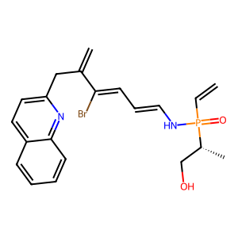
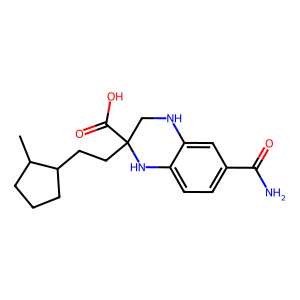

# 🧬 ChemMiniQ3 - with Horizon Loss on SELFIES and Biologically-Aware RL Fine-Tuning
A lightweight experimental generative model for chemistry, built on mini **Qwen2-like backbone** with **multi-horizon predictive loss** for molecular SELFIES representations.

*Prototype research code — not production-ready. Learning by building.*

<p align="center">
  
  
</p>

A custom Qwen2-style language model, adapted for molecular generation:

- ✅ **Qwen2-like Architecture** – Modernized backbone with efficient attention  
- ✅ **Multi-Token Prediction (MTP Head)** – Predicts multiple future tokens (1–3) in parallel  
- ✅ **Horizon Loss** – Weighted multi-horizon objectives for longer-term sequence coherence  
- ✅ **SELFIES-native Tokenizer** – Robust encoding for valid molecular structures with [FastChemTokenizer](https://github.com/gbyuvd/FastChemTokenizer)
- ✅ **Ranger21 Optimizer** – Adaptive optimizer with warmup/warmdown scheduling  
- ✅ **Gradient Checkpointing** – Trainable on smaller GPUs  
- ✅ **Streaming Datase Loader** – Trainable on smaller RAM  

Experimental RL PPO-KL-ready features:
- ✅ **Enhanced Reward Functions** – Validity, Lipinski, charge neutrality, diversity, complexity  
- ✅ **Curriculum Learning** – Gradually increases generation length during training  
- ✅ **Adaptive KL + Entropy Control** – Stabilizes reinforcement learning fine-tuning  

> 💡 **Target domain:** chemistry & molecular generation (SELFIES).  
> 🚀 Architecture is potentially generalizable to other sequence domains.

**Pre-trained model's (non-RL) description:**
```
Model has 9,854,851 trainable parameters.
Input shape: torch.Size([2, 32])
Logits shape: torch.Size([2, 32, 782])
Trained on 14k samples from combined curated dataset built from COCONUTDB (Sorokina et al., 2021),  
                            ChemBL34 (Zdrazil et al., 2023), and SuperNatural3 (Gallo et al. 2023) dataset
Batch Size: 16 (* 4 Grad acc -> ~64)
Optimizer: Ranger21 (MADGRAD-Lookahead-AdaBelief with gradient centralization, linear warm up (22%), 
                      gradient clipping, and L2 weight decay)
Learning rate: 5e-06 (**Warmup complete - lr set to 3.9e-06)

Training log for E-1:
Warm-up
time	step	loss	eval_loss
2025-09-21 11:21:20	3	26.5189	
2025-09-21 11:21:26	6	25.7779	

2nd phase with MTP
time	step	              loss	eval_loss
2025-09-21 11:52:07	140		
2025-09-21 11:54:26	175	  20.4449	
2025-09-21 11:54:41	175		        2.687195301055908
2025-09-21 12:05:43	350	  10.405	
2025-09-21 12:05:58	350		        1.9965996742248535
2025-09-21 12:17:16	525	  8.9447	
2025-09-21 12:17:31	525		        1.8333336114883423
2025-09-21 12:28:34	700	  8.2911	
2025-09-21 12:28:49	700		        1.7291985750198364
2025-09-21 12:28:51	700		

Hardware it was trained on: Laptop with NVIDIA GeForce 930M GPU (2GB VRAM), RAM 12 GB, 2 cores Intel i3, SSD
```

## 🚀 Quick Start

- Clone this repository
- Make sure you have the requierements installed
- Configurable via `config.json`
- Run `python train-withmtp.py`
- Demo for generation with rendered mol image included in `demo_test_mtpresult.ipynb`
  - For demo please extract the `pretrained.7z` archive
- For testing the prototype PPO-KL RL fine-tuning, try running `train_ppokl_selfies.py` on the pretrained model (please make sure the model location is correct)

Tip: feel free to play around with the ChemQ3Model and its training loop/configs! 
The sample dataset is included so you can experiment with it~ especially if you have better compute than mine, feel free to share your results in discussion

- [x] Adjust FastChemTokenizer tokenizer on new data
- [x] Experimenting with early architecture
- [x] Write initial readme
- [x] Upload backbone and MTP train code
- [x] Demo training on 14K data (only 1 epoch, adding another on this data led to slight overfitting)
- [x] Upload the warmup model
- [x] Tidy up and upload JupyterNotebook(s) train/demo along with sample data
- **[ongoing]** Review, clean, and test codes
- [x] Pretraining again after auditing/reviewing the base code
- [x] Test RL code
- [x] Train for 1000 steps for max token length = 80
- [x] Upload RL-trained demo model
- [ ] Ablation studies
- [ ] Implement HF Automodel compatible modules if performance benefit(s) confirmed
- [ ] Complete pretraining on all ~3M dataset (when possible)
  - [ ] Chunk I
  - [ ] Chunk II
  - [ ] Chunk III
  - [ ] Chunk IV
- [ ] Publish complete pretraining on GitHub and HF (if compatible)
- [ ] Complete RL fine-tuning on verified rewards system.
---

## 📁 Project Structure

```
ChemMiniQ3-HoriFIE/
├── ChemQ3MTP.py            # Custom model definition
|── train-withmtp.py        # Main trainer for MTP with curriculum training combining NTP with MTP 
|── config.json             # Configuration for model definition and training
|── FastChemTokenizer.py    # FastChemTokenizer module
|── train_ppokl_selfies.py  # Prototype PPO-KL RL training script
├── README.md               
├── requirements.txt      # I'd recommend making a conda env for this or you could try using different 
                            versions and please note if you encounter a bug
└── selftok_core          # FastChemTokenizer: SELFIES core used for this model, you can try _wtails 
                            if you want to experiment
└── pretrained/
    └── sample-e1/              # Pre-trained weights on sample 14k dataset, 1st epoch
    └── sample-RL/ 
└── demo_test_mtpresult.ipynb   # Demo script for generating SELFIES using pretrained model
└── log_train.txt               # Pre-training console outputs on MTP train
└── data/                       # 14k samples from combined dataset
```

---

## 🔧 Contributing

This project is a **learning experiment** — all contributions are welcome!

- 🧠 Have a better way to implement the methods?
- 📊 Want to add evaluation metrics?
- ✨ Found a bug? Please open an issue!

👉 Please:
- Keep changes minimal and focused.
- Add comments if you change core logic.


---

## ⚠️ Disclaimer

> **This is NOT a production model.**  
>  
> - Built during late-night prototyping sessions 🌙  
> - Not thoroughly validated or benchmarked due to compute constraint
> - Some components are heuristic and unproven  
> - May crash, overfit, or generate nonsense (especially outside molecular data)  
> - I’m still learning PyTorch, attention mechanisms, and transformer internals  
>  
> Use this code to learn and experiment — **not to deploy**.  


## 📜 License

MIT 

## ❤️ Acknowledgments

Based and Inspired by:
- https://github.com/KellerJordan/modded-nanogpt
- https://huggingface.co/docs/transformers/en/model_doc/t5gemma
- https://github.com/aspuru-guzik-group/selfies/
- https://github.com/lessw2020/Ranger21
- https://huggingface.co/gbyuvd/chemfie-gpt-experiment-1
- https://huggingface.co/gbyuvd/bionat-selfies-gen-tokenizer-wordlevel
- Old ChemZiRo-GPT experiment with adding RoPE, GQA, MTP, RMSProp to backbone GPT2 architecture

## References
### BibTeX
#### Qwen3
```bibtex
@misc{qwen3technicalreport,
      title={Qwen3 Technical Report}, 
      author={Qwen Team},
      year={2025},
      eprint={2505.09388},
      archivePrefix={arXiv},
      primaryClass={cs.CL},
      url={https://arxiv.org/abs/2505.09388}, 
}
```

#### COCONUTDB
```bibtex
@article{sorokina2021coconut,
  title={COCONUT online: Collection of Open Natural Products database},
  author={Sorokina, Maria and Merseburger, Peter and Rajan, Kohulan and Yirik, Mehmet Aziz and Steinbeck, Christoph},
  journal={Journal of Cheminformatics},
  volume={13},
  number={1},
  pages={2},
  year={2021},
  doi={10.1186/s13321-020-00478-9}
}
```

#### ChemBL34
```bibtex
@article{zdrazil2023chembl,
  title={The ChEMBL Database in 2023: a drug discovery platform spanning multiple bioactivity data types and time periods},
  author={Zdrazil, Barbara and Felix, Eloy and Hunter, Fiona and Manners, Emma J and Blackshaw, James and Corbett, Sybilla and de Veij, Marleen and Ioannidis, Harris and Lopez, David Mendez and Mosquera, Juan F and Magarinos, Maria Paula and Bosc, Nicolas and Arcila, Ricardo and Kizil{\"o}ren, Tevfik and Gaulton, Anna and Bento, A Patr{\'i}cia and Adasme, Melissa F and Monecke, Peter and Landrum, Gregory A and Leach, Andrew R},
  journal={Nucleic Acids Research},
  year={2023},
  volume={gkad1004},
  doi={10.1093/nar/gkad1004}
}

@misc{chembl34,
  title={ChemBL34},
  year={2023},
  doi={10.6019/CHEMBL.database.34}
}
```

#### SuperNatural3
```bibtex
@article{Gallo2023,
  author = {Gallo, K and Kemmler, E and Goede, A and Becker, F and Dunkel, M and Preissner, R and Banerjee, P},
  title = {{SuperNatural 3.0-a database of natural products and natural product-based derivatives}},
  journal = {Nucleic Acids Research},
  year = {2023},
  month = jan,
  day = {6},
  volume = {51},
  number = {D1},
  pages = {D654-D659},
  doi = {10.1093/nar/gkac1008}
}
```

### Ranger21 Optimizer
``` bibtex
@article{wright2021ranger21,
      title={Ranger21: a synergistic deep learning optimizer}, 
      author={Wright, Less and Demeure, Nestor},
      year={2021},
      journal={arXiv preprint arXiv:2106.13731},
}


